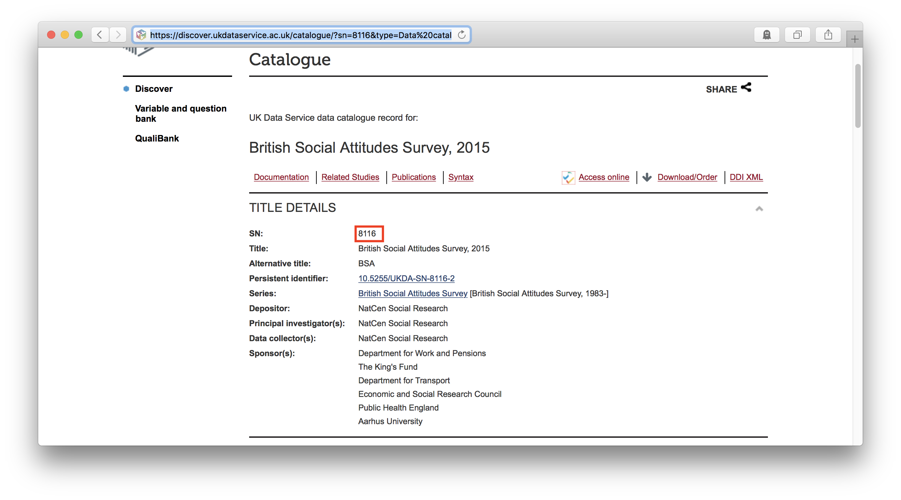

The [UK Data Service](https://www.ukdataservice.ac.uk) (UKDS) is "the UK’s largest collection of social, economic and population data resources."  Researchers taking advantage of these datasets, however, are caught in a bind.  The [UK Data Service terms and conditions](https://www.ukdataservice.ac.uk/get-data/how-to-access/conditions) require users "to give access to the data collections only to registered users with a registered use."[^1] But to ensure that one's work can be reproduced, assessed, and built upon by others, one must provide access to the raw data one employed.  The `ukds` package cuts this knot by providing programmatic, reproducible access to the UK Data Service's datasets from within R. 

## Setup
To use `ukds`, you must first be a registered user of the UKDS, and you must have already registered your 'use of data' for any dataset you will download.

When used interactively, the `ukds_download` function will be ask for the login information required by the UK Data Service: the user's organization, email, and password, as well as the 'use of data' for the datasets to be downloaded. 
After that information is input once, it will be entered automatically for any other download requests made in the same session.  To change this contact information within a session, one may set the argument `reset` to `TRUE` when running `ukds_download` again, and the function will again request the required information. 

An optional, but highly recommended, setup step is to add the information the UK Data Service requires to your [.Rprofile](http://www.statmethods.net/interface/customizing.html) as in the following example:

```{r eval = FALSE}
options("ukds_org" = "UK Data Archive",
        "ukds_user" = "ukf0000000000",
        "ukds_password" = "password123!",
        "ukds_use" = "111111")
```

The `ukds_download` function will then access the information it needs to pass on to the UKDS by default.  This means that researchers will not have to expose their info in their R scripts and that others reproducing their results later will be able to execute those R scripts without modification.  (They will, however, need to enter their own information into their own .Rprofiles, a detail that should be noted in the reproducibility materials to avoid confusion.)


## Use

The `ukds_download` function (1) opens a Chrome browser and navigates to the UKDS's sign-in page, (2) enters the required information to sign in, (3) navigates to a specified dataset, (4) adds the dataset to the specified registered 'use of data', (5) downloads the dataset's files, and, optionally but by default, (6) converts the dataset's files to `.Rdata` format.

Datasets are specified using the `file_id` argument.  The UKDS uses a unique SN number to identify each of its datasets.  For the [2015 British Social Attitudes Survey](https://discover.ukdataservice.ac.uk/catalogue/?sn=8116&type=Data%20catalogue), for example, the file id is 8116:



To reproducibly download this dataset:

```{r eval=FALSE}
ukds_download(file_id = "8116")
```

Multiple datasets may be downloaded from the same research area in a single command by passing a vector of ids to `file_id`.  The following downloads the above-described 2015 BSA along with those for 2014 and 2013:

```{r eval=FALSE}
ukds_download(file_id = c("8116", "7809", "7500"))
```

After the needed datasets are downloaded, they are, by default, converted to `.RData` format (via `rio::convert()`) and ready to be loaded into R using `load()` or `rio::import()`.

```{r eval=FALSE}
bsa2015 <- rio::import("ukds_data/8116/bsa15_to_ukds_final.RData)
```

[^1]: The terms _do_ include exceptions "for teaching and the use of data collections for Commercial purposes set out in an additional Commercial Licence," but these clearly do not apply to the public provision of materials for reproducibility purposes.
